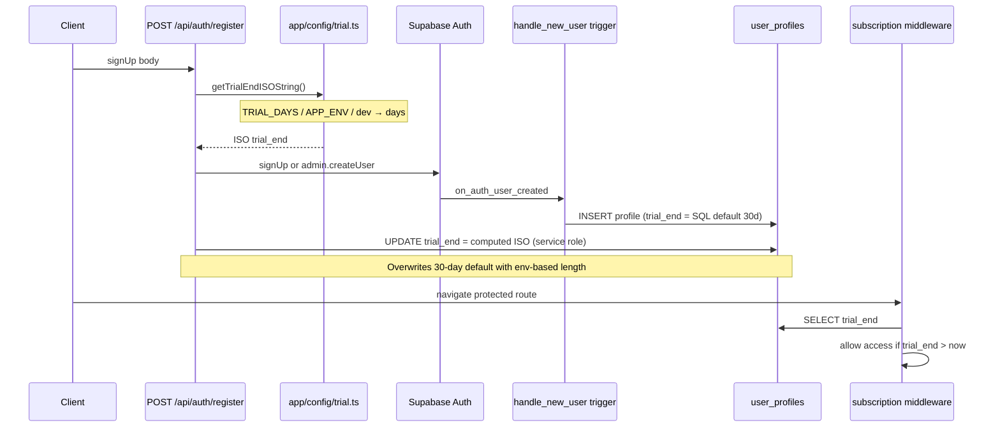
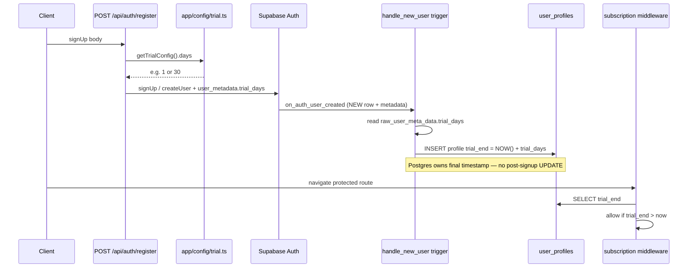
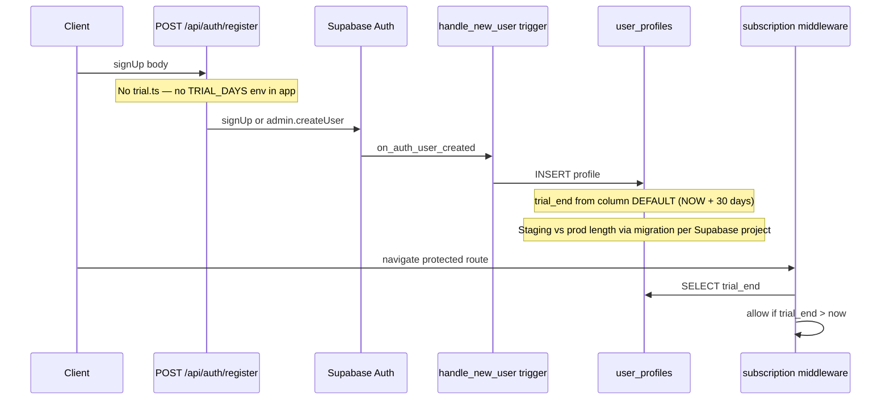

# 04_12 Remaining Extraction

This note captures the extraction work that still appears open after the recent standalone auth/docs cleanup.

**Checkboxes:** `- [x]` = done in this repo as of the last update note at the bottom. `- [ ]` = still open or needs a human pass. Edit this file as you complete items.

## Environment scope (extraction sign-off)

Extraction closure applies to **development** and **test** only:

| Environment | Meaning in this repo |
|-------------|----------------------|
| **Development** | Local `.env` + `npm run dev` (localhost) |
| **Test** | Vercel Preview, Git branch **`test`** (`test.myfocusrewards.com`) + Supabase **`time-reward-test`** |

**Production / `main` deploy env is out of scope** for extraction checkboxes until launch. Track prod values in your spreadsheet when needed; do not block “Done when” on prod reconciliation.

**Third-party onboarding pass is optional:** verifying that *another* developer can cold-start from the repo alone is **not required** for extraction sign-off — deployment either way will need testing; defer until after launch prep or when onboarding a collaborator (not planned for the coming week).

**Source of truth for values:** your env spreadsheet. Repo docs (`.env.example`, `ENV-SETUP.md`) describe **names, usage, and dev/test expectations** — not a full copy of every cell.

## Already completed

- [x] Standalone repo shell created
- [x] Generated folders treated as non-source (`node_modules`, `.nuxt`, `.output`, etc.)
- [x] Current `.env` handling decision made
- [x] `/confirm` auth callback mismatch resolved (`nuxt.config.ts` + `app/pages/confirm.vue`)
- [x] `docs/README.md` rewritten for standalone use
- [x] `Playwright/index.md` rewritten for standalone use
- [x] Canonical PRD decision made
  - [x] `docs/REARCHITECT/PRD for NUXT.md` is canonical
  - [x] Historical PRD variants moved under `docs/REARCHITECT/historical/`

## Remaining extraction work

### 1. Historical docs decision

**Archived (migration-era product deltas):**

- [x] `docs/historical/migration/Group B Rewards Implementation Plan.md` (moved from `docs/` root)
- [x] `docs/historical/migration/PRD - Nuxt Supabase Migration.Rewards Deltas March11.md` (moved from `docs/` root)
- [x] Folder explainer: `docs/historical/migration/README.md` (points to canonical PRD)

**Policy closed (2026-05-10):**

- [x] `CHANGELOG.md` — kept at repo root; pruned confusing migration appendix (duplicate migration list, long Blazor stack block); added short “Historical context” pointer.
- [x] `docs/SESSION_NOTES_*.md` — moved to `docs/historical/session-notes/` (see `README.md` there).

### 2. Deployment review

**Hosting decision:**

- [x ] Decide: stay on Vercel 

**If deploying (verify and document):**
- [x] Build command
- [x] Output directory
- [x] Environment-variable mapping — **dev + test only** (local `.env` ↔ Vercel Preview branch `test` ↔ `.env.example` ↔ `docs/ENV-SETUP.md` ↔ code). Prod deferred at launch. See **§2a** table below.
- [x] Region choice
- [x] Security headers

### 2a. Env reconciliation table (dev + test)

One row per env var; one column per place it can be declared or used. Tracks **presence/usage, not secret values** (values live in your spreadsheet / `.env`). Scope: **development + test** (prod out of scope until launch).

**Legend:** ✓ = present/used · ✗ = absent · `comment` = commented placeholder in `.env.example` (name documented, unset locally) · `ph` = placeholder only (no real value) · `slot` = declared in `nuxt.config.ts` `runtimeConfig` but not actually read by code · `?` = verify.

Snapshot date: **2026-06-07**.

| Variable | local `.env` | Vercel `test` | `.env.example` | `ENV-SETUP.md` | code usage |
|----------|:---:|:---:|:---:|:---:|---|
| `SUPABASE_URL` | ✓ | ✓ | ✓ | ✓ | `@nuxtjs/supabase`; `config.public.supabaseUrl` (webhook, login, register) |
| `SUPABASE_KEY` | ✓ | ✓ | ✓ | ✓ | `@nuxtjs/supabase` anon key; `public.supabaseKey` (login, register) |
| `SUPABASE_SECRET_KEY` | ✓ | ✓ | ✓ | ✓ | `@nuxtjs/supabase` `serverSupabaseServiceRole`; `runtimeConfig.supabaseSecretKey`; Stripe webhook admin client; scripts |
| `NUXT_STRIPE_SECRET_KEY` | ✓ | ✓ | ✓ | ✓ | `stripeSecretKey`; all `server/api/stripe/*` |
| `NUXT_PUBLIC_STRIPE_PUBLISHABLE_KEY` | ✓ | ✓ | ✓ | ~ | `public.stripePublishableKey` **`slot`** — declared, not read in code |
| `NUXT_STRIPE_WEBHOOK_SECRET` | ✓ | ✓ | ✓ | ✓ | `stripeWebhookSecret`; `webhook.post.ts` |
| `NUXT_STRIPE_PRICE_ID_MONTHLY` | ✓ | ✓ | ✓ | ~ | `stripePriceIdMonthly`; `plans.get.ts`, `checkout.post.ts` |
| `NUXT_STRIPE_PRICE_ID_QUARTERLY` | ✓ | ✓ | ✓ | ~ | `stripePriceIdQuarterly`; plans/checkout |
| `NUXT_STRIPE_PRICE_ID_YEARLY` | ✓ | ✓ | ✓ | ~ | `stripePriceIdYearly`; plans/checkout |
| `NUXT_PUBLIC_APP_URL` | ✓ | ✓ | ✓ | ✓ | `public.appUrl`; redirects, legal pages, checkout, register |
| `NUXT_PUBLIC_SHOW_TEST_USERS` | ✓  | ✓ | comment | ✓ (reserved) | **reserved** — on Vercel `test` and local `develop`; not wired; future landing/auth UI |
| `NUXT_PUBLIC_SHOW_PHONE_NUMBER` | ✓  | ✓ | comment | ✓ (reserved) | **reserved** — on Vercel `test` and local `develop`; not wired; future landing/contact UI |
| `NUXT_PUBLIC_HIDE_LANDING_PAGE_COUNTERS` | ✓  | ✓ | comment | ✓ (reserved) | **reserved** — on Vercel `test` and local `develop`; not wired; future landing UI |
| `BOZ23` | ✓ | ✓ | ✓ | ✓ | `runtimeConfig.boz23`; `registration-policy.get.ts` |
| `KV_REST_API_URL` | ✓ | ✓ | ✓ | ✓ | `kvRestApiUrl`; `/api/keepalive` |
| `KV_REST_API_TOKEN` | ✓ | ✓ | ✓ | ✓ | `kvRestApiToken`; `/api/keepalive` |
| `KV_REST_API_READ_ONLY_TOKEN` | ✗ | ✓ | ✗ | ✗ | ✗ — Vercel KV default, unused |
| `KV_REDIS_URL` | ✗ | ✓ | ✗ | ✗ | ✗ — Vercel KV default, unused |
| `KV_URL` | ✗ | ✓ | ✗ | ✗ | ✗ — Vercel KV default, unused |
| `GEOCODING_API_KEY` | ✗ | ✓ | comment | ✓ (reserved) | **reserved** — on Vercel; not wired; planned geocoding integration |
| `TURNSTILE_SITE_KEY` | `ph` | ✓ | ✓ | ✓ (reserved) | `public.turnstileSiteKey` **`slot`** — not wired |
| `TURNSTILE_SECRET_KEY` | `ph` | ✓ | ✓ | ✓ (reserved) | `turnstileSecretKey` **`slot`** — not wired |
| `RESEND_API_KEY` | `ph` | ✓ | ✓ | ✓ (reserved) | `resendApiKey` **`slot`** — not wired (PRD Phase 3) |
| `EMAIL_FROM_ADDRESS` | ✗ | ✓ | ✗ | ✗ | ✗ — reserved (Resend) |
| `EMAIL_FROM_NAME` | ✗ | ✓ | ✗ | ✗ | ✗ — reserved (Resend) |
| `EMAIL_AUTOMATION_ENABLED` | ✗ | ✓ | ✗ | ✗ | ✗ — reserved until Resend Phase 4 |
| `EMAIL_DISPATCH_INTERVAL_MS` | ✗ | ✓ | ✗ | ✗ | ✗ — reserved until Resend Phase 4 |

**~** in `ENV-SETUP.md` = covered only by the general "Stripe keys / price IDs" sentence, not named individually.

**`local`** = documented for local dev in `.env.example`; intentionally **not** on Vercel Preview branch `test` (defaults apply on preview).

#### Local-only variables (not on Vercel `test`)

| Variable | local `.env` | Vercel `test` | `.env.example` | `ENV-SETUP.md` | code usage |
|----------|:---:|:---:|:---:|:---:|---|
| `TRIAL_DAYS` / `NUXT_TRIAL_DAYS` | ✓ | ✗ | ✓ | ✗ | **reserved** — read only in `app/config/trial.ts` (not wired); live trial = DB default 30d |
| `TRIAL_BYPASS` / `NUXT_PUBLIC_TRIAL_BYPASS` | ✓ | ✗ | ✓ | ✗ | `app/middleware/subscription.ts` — bypass only when **`import.meta.dev`** and flag `true` (local `npm run dev` only) |
| `NUXT_SKIP_EMAIL_CONFIRMATION` | ✓ | ✗ | ✓ | ~ | `server/api/auth/register.post.ts` — on preview **defaults false** → normal email-confirmation signup |
| `ALLOW_DEMO_DATA` | ✓ | ✗ | ✓ | ~ | `server/api/admin/load-demo-data.post.ts` — on preview **off** unless set (`NODE_ENV` is not `development`) |
| `NUXT_PUBLIC_ALLOW_DEMO_DATA` | ✓ | ✗ | ✓ | ~ | `app/pages/home.vue` — demo button hidden on preview unless set |
| `UNDER_CONSTRUCTION` | ✓ | ✗ | ✓ | ✗ | Production gate only (`=1`); unset on preview → normal app (intended for `test.myfocusrewards.com`) |
| `NUXT_PUBLIC_APP_ENV` | ✓ | ✗ | ✓ | ✗ | **reserved** — only referenced in unwired `trial.ts`; `runtimeConfig.public.appEnv` slot unused |

**Extraction decision (2026-06-08):** Keep trial **as-is** — DB default + `subscription` middleware. Keep `trial.ts` documented as reserved helper (Option C in practice; Options A/B in §2a if wired later). Do not remove from repo.

#### Legacy / remove from Vercel

| Variable | local `.env` | Vercel `test` | `.env.example` | `ENV-SETUP.md` | code usage |
|----------|:---:|:---:|:---:|:---:|---|
| `NUXT_PUBLIC_SITE_URL` | ✗ | ✗ | ✗ | ✗ | **removed** from Vercel (2026-06-16) — zero references in code; use **`NUXT_PUBLIC_APP_URL`** only |

#### `app/config/trial.ts` — helper exists but is not wired

This file is **not “dead” in the sense of broken** — it exports working functions — but **nothing in the app calls them**, so **`TRIAL_DAYS` and `NUXT_PUBLIC_APP_ENV` have no effect on real users today**.

**What actually sets trial length at signup today**

1. Client calls `POST /api/auth/register` (`server/api/auth/register.post.ts`), which creates a Supabase Auth user (`signUp` or admin `createUser`). It does **not** set `trial_end`.
2. Supabase fires the database trigger **`on_auth_user_created`** → **`handle_new_user()`** (see session notes 2026-02-27), which inserts `user_profiles` (+ `user_settings`).
3. `user_profiles.trial_end` comes from the **column default** in migration `001_user_profiles.sql`:

   `trial_end TIMESTAMPTZ DEFAULT (NOW() + INTERVAL '30 days')`

4. Later, **`app/middleware/subscription.ts`** reads `trial_end` from the database and compares it to `now` — still no import of `trial.ts`.

So every new user gets **30 days** from Postgres unless you change the DB default or update the row after signup.

**What `trial.ts` would do if it were wired**

| Export | Purpose |
|--------|---------|
| `getTrialConfig()` | Returns `{ days, ms }` from `TRIAL_DAYS` / `NUXT_TRIAL_DAYS`, else 1 day in dev, 30 days if `NUXT_PUBLIC_APP_ENV=staging`, else 30 days “production” |
| `getTrialEndISOString()` | `now + getTrialConfig().ms` as ISO string for storage in `user_profiles.trial_end` |

**What “wire registration to use it” means (concrete options)**

Pick one place to **write** `trial_end` using `getTrialEndISOString()` instead of relying only on the 30-day SQL default:

| Approach | Where to change | Notes |
|----------|-----------------|-------|
| **A. Server after signup** | `register.post.ts` | After auth user exists, use **service role** to `update user_profiles set trial_end = …` (profile row must exist — today the DB trigger creates it on auth insert). |
| **B. DB trigger** | New Supabase migration | Replace fixed `INTERVAL '30 days'` with app-passed metadata (e.g. store desired days in `raw_user_meta_data` at signup, trigger reads it). Env vars like `TRIAL_DAYS` still wouldn’t reach Postgres unless the app passes them in metadata. |
| **C. Delete `trial.ts`** | Remove file + env vars | Keep single source of truth: SQL default (and/or change default via migration for staging vs prod). |

**Sequence flows (when implemented)**

*Shared later step:* `subscription` middleware reads `user_profiles.trial_end` and allows or redirects to `/subscription/expired`.

**Option A — server overwrites `trial_end` after trigger (uses `trial.ts`)**

**Option B — app passes duration in metadata; trigger writes `trial_end` (env → app → DB)**

**Option C — delete `trial.ts`; SQL default (or migration) is sole source**

**Policy:** **`TRIAL_DAYS` / `NUXT_PUBLIC_APP_ENV`** stay in `.env.example` as reserved until registration wires `trial.ts` (Options A/B in §2a). They do not change preview or prod behavior today. **`TRIAL_BYPASS`** is wired for local dev only.

**Related:** `TRIAL_BYPASS` **is** wired (`subscription.ts`) but only applies when **`import.meta.dev`** (local dev), so it correctly stays off Vercel preview without any env var there.

#### Gaps / actions surfaced (feed 2b/2c)

1. **`SUPABASE_SECRET_KEY` migration (2026-06-07):** Vercel dev/test/prod now use `SUPABASE_SECRET_KEY` (replaces `SUPABASE_SERVICE_ROLE_KEY`). Code updated: `nuxt.config.ts` → `supabaseSecretKey`, webhook, scripts, Playwright reset-timers.
2. **`NUXT_PUBLIC_SHOW_TEST_USERS` / `_SHOW_PHONE_NUMBER` / `_HIDE_LANDING_PAGE_COUNTERS` — resolved (2026-06-07):** Keep on Vercel `test`; label **reserved** in 2b. Documented in `.env.example` (commented) and `ENV-SETUP.md`. No code wiring until a future UI phase — inert today by design, not an oversight.
3. **`GEOCODING_API_KEY` — resolved (2026-06-07):** Keep on Vercel; label **reserved** in 2b. Documented in `.env.example` (commented) and `ENV-SETUP.md`. No code wiring yet — inert by design until geocoding is implemented.
4. **KV defaults** (`KV_REST_API_READ_ONLY_TOKEN`, `KV_REDIS_URL`, `KV_URL`) auto-added by Vercel KV; harmless. Only `KV_REST_API_URL` + `KV_REST_API_TOKEN` are used. Leave as-is.
5. **`KV_REST_API_*` and `BOZ23` — resolved (2026-06-07):** Short notes added to `ENV-SETUP.md`.
6. **Reserved (slot-only or documented, not wired):** `NUXT_PUBLIC_STRIPE_PUBLISHABLE_KEY`, **`NUXT_PUBLIC_SHOW_*` / `_HIDE_LANDING_PAGE_COUNTERS`**, **`GEOCODING_API_KEY`**, `TURNSTILE_*`, `RESEND_API_KEY`, `EMAIL_*` — intentional; label in **2b**.
7. **`NUXT_STRIPE_PRICE_ID_DEFAULT` removed (2026-06-07):** Legacy nameless checkout fallback deleted; `POST /api/stripe/checkout` requires `plan` or `priceId`. Remove from local `.env` / Vercel if still set.
8. **`NUXT_PUBLIC_SITE_URL` on Vercel `test` — resolved (2026-06-16):** Removed from Vercel; app reads **`NUXT_PUBLIC_APP_URL`** only.
9. **Local-only vars (2026-06-07):** `TRIAL_*`, `NUXT_SKIP_EMAIL_CONFIRMATION`, demo flags, `UNDER_CONSTRUCTION`, `NUXT_PUBLIC_APP_ENV` — documented in §2a “Local-only” table; absence on Vercel `test` is intentional. See **`trial.ts` not wired** note for trial duration behavior.

### 3. External integrations review

**Policy + behavior:**

- [x] Stripe — **keep** on dev + test; “not configured” behavior documented in `docs/ENV-SETUP.md` (detail: `discussions/05_28 Section 3.md`)
- [x] Resend — **keep** on Vercel; implement PRD Phases 1–3; vars **reserved** until wired; `EMAIL_AUTOMATION_*` until Phase 4 — documented in `docs/ENV-SETUP.md` (PRD: `docs/PRD for Resend use.md`)
- [x] Cloudflare Turnstile — **optional / off**; keys may stay on Vercel as **reserved**; not wired — documented in `docs/ENV-SETUP.md`
  *Goal: no ambiguous partial config; graceful failure where a feature is off.*

### 4. Trim remaining parent-project language

**Scopes:**

- [x] **App/runtime code (`app/`):** checked for noisy setup-only phrasing (e.g. parent directory, subfolder until separation); clean for that pass.
- [x] **Docs / onboarding path:** optional pass to reduce confusing “parent / migration” wording outside intentional historical docs (session notes, `docs/historical/`, PRD lineage). *Search hints:* `migration`, `parent project`, `parent directory`, `remaining migration work`, `subfolder until separation` — not every hit should be removed. *(2026-06-07: `docs/README.md`, `ENV-SETUP.md`, PRD paths, runbook, checklist; prorated-rewards note → `docs/historical/migration/legacy-blazor-prorated-rewards.md`.)*

### 5. Optional documentation simplification

- [ ] Consolidate or reorganize setup docs
- [ ] Test docs
- [ ] Release / deploy docs
- [ ] Historical notes  
  *Optional; improves handoff.*

### 6. `junk` materials

- [x] No obsolete **parent-project** junk in tracked repo paths (`app/`, `docs/`, `server/`, etc.).
- [x] Local **`junk/`** allowed when **gitignored** (see `.gitignore`) — scratch/reference only; not part of extraction handoff. Obsolete parent extraction debris must not live in git.

### 7. Validation after extraction

**Commands:**

- [x] `npm install` (repo root) — see Progress log
- [x] `npm run build` (repo root) — see Progress log
- [x] `npm run dev` (repo root) — confirm clean startup

**Manual smoke (browser):**

- [x] Landing page loads
- [x] Login page loads
- [x] Register page loads
- [x] Authenticated navigation reaches `/home`
- [x] Settings page loads
- [x] Rewards page loads
- [x] Connection state UI behaves normally

### 8. Database / app behavior checks

Verify against Supabase **`time-reward-test`** (test environment — not prod):

- [x] User registration works
- [x] Email confirmation redirect on preview (`test.myfocusrewards.com` → `/confirm`; not localhost) — verified 2026-06-16
- [x] Post-confirm login on preview — verified 2026-06-16
- [x] User login by username works
- [x] Activities can be created and timed
- [x] AutoPause triggers correctly
- [x] Offline queue replays commands after reconnect
- [x] Rewards load and can be created
- [x] Breaks load and can be created
- [x] Demo reset works when enabled

### 9. Playwright setup verification

- [x] `npm install` inside `Playwright/` — see Progress log
- [x] Confirm Playwright config / `baseURL` / assumptions match the extracted app (`Playwright/playwright.config.ts`, `Playwright/index.md`)
- [x] Update any stale test-doc references

**Reminder:**

- [x] `Playwright/test-utils/reset-timers.ts` expects environment values from the app root `.env` (verify when running tests)

## Practical next sequence

**Extraction core (dev + test) is complete as of 2026-06-16.** §1–§4, §6–§9 and “Done when” (except optional cold-start onboarding) are closed.

**Closed in this sequence:**

1. [x] Review deployment / env assumptions for **dev + test** (§2, §3) — 2026-06-07+
2. [x] Verify target Supabase project and app behavior (§8) — `time-reward-test`, 2026-06-16
3. [x] `npm run dev` + install/build + smoke checks (§7) — 2026-06-16
4. [x] Playwright config + selector audit + smoke (§9) — 2026-06-16
5. [x] Historical-doc policy for `CHANGELOG.md` and session notes (§1) — 2026-05-10

**Optional / when you have time (not extraction blockers):**

- [x] Finish **preview** manual pass on `test.myfocusrewards.com` — auth confirmation redirect verified (deploy + Supabase Auth URLs; link returns to `test.myfocusrewards.com/confirm`, not localhost) — 2026-06-16
- [x] Remove legacy **`NUXT_PUBLIC_SITE_URL`** from Vercel `test` (§2a item 8) — confirmed removed 2026-06-16
- [ ] §5 documentation simplification (consolidate setup / test / release docs)
- [~] Cold-start onboarding by another developer — deferred (see “Done when”)

**After extraction — product work, not extraction:**

- GSD **Milestone B** (timing/sync re-engineering) — see `docs/06_16 TODO (HIGH LEVEL).md`
- **Production launch** checklist (separate Supabase project, prod env, `myfocusrewards.com`) — out of scope until launch

## Done when

- [x] The app runs from the extracted repo without depending on the parent repo *(verify via §7–§8 on dev + test)*
- [x] Core onboarding docs do not require the parent repo for setup *(standalone `docs/README.md`, `docs/ENV-SETUP.md`, extraction checklist)*
- [x] **`time-reward-test`** is connected and migrated *(test Supabase — prod project deferred)*
- [x] Deployment / env config is coherent for **development and test** *(local `.env` + Vercel Preview `test`; prod not required)*
- [x] The canonical PRD is inside the extracted repo (`docs/REARCHITECT/PRD for NUXT.md`)
- [~] ~~Another developer can set up the app using only the extracted repo~~ **Optional / deferred** *(local dev + test preview; prod launch checklist separate)* — not a “Done when” blocker; onboarding docs exist (`docs/README.md`, `ENV-SETUP.md`); full cold-start verification deferred (2026-06-16)

## Progress (automated / agent)

- **2026-04-24:** Repo-root `npm install` and `npm run build` succeeded; `Playwright/` `npm install` succeeded. Manual browser smoke and Supabase project checks remain **human** tasks—see `docs/EXTRACTION/extraction guide.checklist.md` and `docs/ENV-SETUP.md`.
- **2026-05-10:** Checkboxes + status pass; `app/` language pass; no `junk/`; session notes archived to `docs/historical/session-notes/`; `CHANGELOG.md` migration appendix pruned, Fixed/Removed merge corruption repaired, pointers to `supabase/migrations/` and historical docs added.
- **2026-06-07:** §4 docs/onboarding pass — repo-root paths in `docs/README.md`, `ENV-SETUP.md`, PRD, runbook, extraction docs; `_FORLATER.md` paths; prorated-rewards note → `docs/historical/migration/legacy-blazor-prorated-rewards.md`.
- **2026-06-16:** Auth confirmation redirect fix (`resolveAppBaseUrl`, request origin over stale `NUXT_PUBLIC_APP_URL`); §7 smoke marked complete; §8 Supabase matrix verified on `time-reward-test`; Playwright §9 audit doc + GSD Milestone B planning doc; demo-data env must be `true` not `1` on Vercel. Session notes → `docs/historical/session-notes/SESSION_NOTES_2026-06-16.md`.
- **2026-06-16:** §9 Playwright close-out — fixed activity card selectors (`div.group` → `div.space-y-3 > div` + `h3`), stale `.env` path wording, `reset-timers` ESM `__dirname` fix; `reset-timers` + `multi-tab-sync` smoke passed (`AUTOPAUSE_MINUTES=1`).
- **2026-06-16:** “Another developer can set up” marked **optional / deferred** — not blocking extraction; cold-start pass deferred past the coming week.
- **2026-06-16:** **`NUXT_PUBLIC_SITE_URL`** confirmed removed from Vercel `test` env.
- **2026-06-16:** Preview auth confirmation redirect verified on `test.myfocusrewards.com` after deploy + Supabase Auth URL config; post-confirm login verified.
