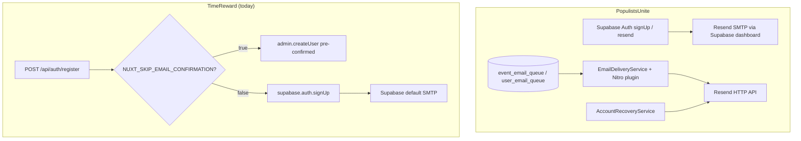

# Compare: Resend Use in TimeReward vs PopulistsUnite

**TimeReward repo:** `NUXT_TimeReward` (this project)  
**Reference repo:** [`sldev2/PopulistsUnite`](https://github.com/sldev2/PopulistsUnite) (branch `master`, analyzed 2026-05-27)

---

## Executive summary

PopulistsUnite uses Resend in **two deliberate channels**:

1. **Supabase Auth → Resend SMTP** — signup verification and other auth templates Supabase generates automatically.
2. **Nuxt server → Resend API** — custom transactional mail the app owns (queued notifications, immediate password reset).

TimeReward today uses **neither channel in application code**. Auth email is delegated entirely to Supabase (default inbuilt SMTP when confirmation is enabled). Vercel env vars for Resend exist but are unused placeholders copied from operational patterns elsewhere.

---

## Architecture comparison

---

## Feature matrix

| Capability | PopulistsUnite | TimeReward |
|------------|----------------|------------|
| **`resend` npm dependency** | Yes (`^6.4.1`) | **No** |
| **Runtime config: `resendApiKey`** | Wired + used | Declared in `nuxt.config.ts`, **unused** |
| **Runtime config: `email.*` block** | `fromAddress`, `fromName`, `automationEnabled`, `dispatchIntervalMs` | **Not present** (only `resendApiKey` slot) |
| **Supabase Auth → Resend SMTP** | Configured in Supabase dashboard (documented) | **Planned** (`docs/_FORLATER.md`); not verified in repo |
| **Resend API for app-owned mail** | Yes — `EmailDeliveryService` | **No** |
| **Email queue tables** | `event_email_queue`, `user_email_queue` | **None** |
| **Background dispatcher** | Nitro plugin `email-dispatcher.ts` + CLI `dispatch-email.mjs` | **None** |
| **Password reset via Resend API** | Yes — `AccountRecoveryService` sends immediately | **No** forgot-password flow |
| **Resend verification endpoint** | `POST /api/auth/resend-verification` → `supabase.auth.resend()` | **No** |
| **Monitoring / failure audit** | `monitoring_events`, queue `status` + `failure_reason` | **None** for email |
| **Rate limiting on email endpoints** | Yes (`auth-resend-verification`: 5/hr) | N/A (no endpoints) |
| **CAPTCHA before email send** | Turnstile on recovery | Turnstile keys in Vercel inventory; **not wired to email** |
| **Local dev without Vercel** | Supported (`.env` + `npm run dev` / CLI script) | Supported for app; **Resend not invoked** |
| **Verified sender domain** | `populistsunite.com` | `myfocusrewards.com` (`send` subdomain DKIM in DNS) |

---

## Environment variables

| Variable | PopulistsUnite | TimeReward |
|----------|----------------|------------|
| `RESEND_API_KEY` | Required for API path; also Supabase SMTP password | In Vercel inventory + `.env.example`; **unused in code** |
| `EMAIL_FROM_ADDRESS` | Used by dispatcher + recovery | In Vercel inventory (`support@myfocusrewards.com` noted in session docs); **unused in code** |
| `EMAIL_FROM_NAME` | Used | In Vercel inventory; **unused in code** |
| `EMAIL_AUTOMATION_ENABLED` | Gates Nitro dispatcher plugin | In Vercel inventory; **no plugin to gate** |
| `EMAIL_DISPATCH_INTERVAL_MS` | Dispatcher interval (default 60s) | In Vercel inventory; **no dispatcher** |
| `RESEND_SMTP_*` | Documented in `.env.example` for human Supabase setup | **Not in `.env.example`** |
| `NUXT_SKIP_EMAIL_CONFIRMATION` | N/A (PU uses explicit verify flow) | **`true` typical for local dev** |

---

## Code path comparison

### Auth / signup confirmation

**PopulistsUnite**

- Registration triggers Supabase signup; confirmation email goes through **Supabase → Resend SMTP**.
- `POST /api/auth/resend-verification` calls `supabase.auth.resend({ type: 'signup', ... })` with redirect to `/register/verify-email`.
- UI: dedicated verify page, resend button, rate limits.

**TimeReward**

- `POST /api/auth/register` branches on `NUXT_SKIP_EMAIL_CONFIRMATION`.
- Dev default: `admin.createUser` with `email_confirm: true` — **no email**.
- Prod path: `signUp()` → Supabase default SMTP (hourly cap documented in `docs/05_23 current auth email rate limit.md`).
- UI: register success messaging; `/confirm` callback route; **no resend-verification API**.

### Transactional / queued email

**PopulistsUnite**

- Business events enqueue rows (RSVP, reminders, cancellations, mutual contact).
- `EmailDeliveryService` renders HTML/text, sends via `resend.emails.send`, updates queue status.
- Runs on interval inside Nitro when `EMAIL_AUTOMATION_ENABLED=true`, or manually via `pnpm run dispatch-emails`.

**TimeReward**

- No queue tables, no dispatcher, no templates.
- Privacy policy mentions Supabase and/or Resend as possible providers — aspirational only.

### Password recovery

**PopulistsUnite**

- Custom flow: `password_reset_tokens` table, `AccountRecoveryService`, **immediate** Resend API send (not queued).
- Documented in `docs/Password Reset Email Implementation.md`.

**TimeReward**

- No forgot-password page or recovery API.
- Would rely on Supabase built-in reset **if** added later, unless a PU-style custom service is implemented.

---

## Operational / DNS context

| Topic | PopulistsUnite | TimeReward |
|-------|----------------|------------|
| **Outbound domain** | `populistsunite.com` verified in Resend | `send.myfocusrewards.com` (SES/Resend DKIM in GoDaddy DNS) |
| **Inbound mail** | Separate concern | Google Workspace (`spero@myfocusrewards.com`) |
| **Hosting** | Vercel (historically Netlify mentioned in docs) | Vercel |
| **Hosting required for Resend?** | **No** — API + SMTP work from localhost | **No** |

---

## Documentation maturity

| Doc type | PopulistsUnite | TimeReward |
|----------|----------------|------------|
| Resend + Supabase split | `docs/Resend with and without Supabase Integrations.md` | This compare doc + `docs/Resend Use by Environment.md` |
| SMTP setup checklist | `docs/12_07 verification email.md`, `.env.example` | `docs/_FORLATER.md` item 4 |
| Testing runbook | `discussions/11_5 test new Resend setup.md` | `docs/Manual Testing Plan.md` (deferred Section 3.4) |
| Rate limits | `docs/INTRO rate-limiting.md` | `docs/05_23 current auth email rate limit.md` (Supabase-side only) |

---

## Key gaps (TimeReward vs PopulistsUnite)

1. **No `resend` package or send helper** — env vars are inert.
2. **No Supabase custom SMTP documentation applied** — still on default Supabase sender when confirmation enabled.
3. **No resend-verification API or UI** — harder to test prod-like signup locally.
4. **No transactional email infrastructure** — no queue, dispatcher, or monitoring (may be acceptable until product needs notifications).
5. **No custom password reset** — PU sends time-sensitive mail immediately via API; TR has no equivalent.
6. **Vercel env inventory ahead of code** — `EMAIL_AUTOMATION_*` suggests planned parity that is not implemented.

---

## What TimeReward should adopt first (recommended order)

See [`docs/PRD for Resend use.md`](PRD%20for%20Resend%20use.md) for full requirements. Summary:

1. **Supabase → Resend SMTP** (auth emails) — smallest change, fixes rate limits and sender branding.
2. **Resend verification resend endpoint + UI** — matches PU auth UX pattern.
3. **Shared `EmailDeliveryService` pattern** — only when product defines transactional emails worth queuing.
4. **Immediate-send path for time-sensitive mail** — password reset when that feature ships.

---

## References (PopulistsUnite)

| Artifact | Path in `sldev2/PopulistsUnite` |
|----------|----------------------------------|
| Delivery service | `populists-unite/server/services/EmailDeliveryService.ts` |
| Nitro dispatcher | `populists-unite/server/plugins/email-dispatcher.ts` |
| CLI dispatcher | `populists-unite/scripts/dispatch-email.mjs` |
| Password reset | `populists-unite/server/services/AccountRecoveryService.ts` |
| Resend verification API | `populists-unite/server/api/auth/resend-verification.post.ts` |
| Architecture note | `docs/Resend with and without Supabase Integrations.md` |
